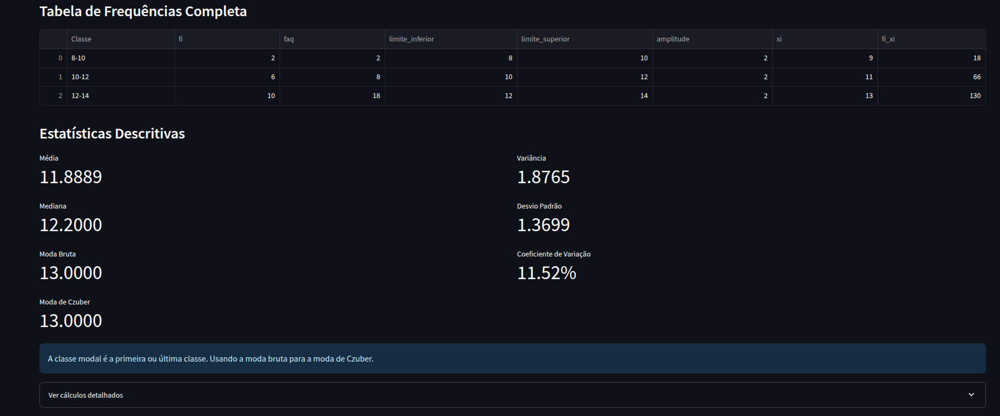
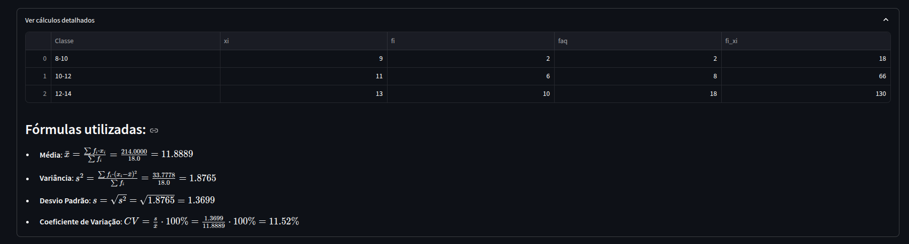

# calculadora-agrupamento-em-classes
Trabalho de faculdade para disciplina da estatistica. Consiste em uma calculadora para média, mediana, moda bruta e moda Czuber, variância, coeficiente de variância

# 🚀 Como rodar este projeto no Windows

Siga os passos abaixo para executar este projeto mesmo sem ter experiência prévia com código.

---

## 🛠️ Pré-requisitos

- Ter o **Python** instalado no seu computador.
- Ter os arquivos do projeto baixados no seu computador.

---

## 📦 Passo a passo

### 1️⃣ Abra o Prompt de Comando (cmd) ou PowerShell

- Pressione `Windows + R`, digite `cmd` ou `powershell` e tecle `Enter`.

---

### 2️⃣ Navegue até a pasta do projeto

Digite no terminal:

```bash
cd C:\Caminho\Da\Sua\Pasta
````

👉 **Dica:** Digite `cd `, arraste a pasta do projeto até o terminal e aperte `Enter`.

---

### 3️⃣ Crie um ambiente virtual

Execute:

```bash
python -m venv venv
```

---

### 4️⃣ Ative o ambiente virtual

* **Se estiver no Prompt de Comando (cmd):**

```bash
venv\Scripts\activate
```

* **Se estiver no PowerShell:**

```bash
.\venv\Scripts\Activate.ps1
```

⚠️ **Se aparecer um erro sobre execução de scripts no PowerShell**, rode este comando e pressione `Enter`:

```bash
Set-ExecutionPolicy -ExecutionPolicy RemoteSigned -Scope CurrentUser
```

Depois tente ativar novamente.

---

### 5️⃣ Instale as dependências

```bash
pip install -r requirements.txt
```

---

### 6️⃣ Rode o projeto

```bash
streamlit run src/main.py
```

O navegador abrirá automaticamente com o projeto rodando.

---

## ✅ Pronto!

Se quiser parar o projeto, volte ao terminal e pressione `Ctrl + C`.

---

# Features


# Resultados


