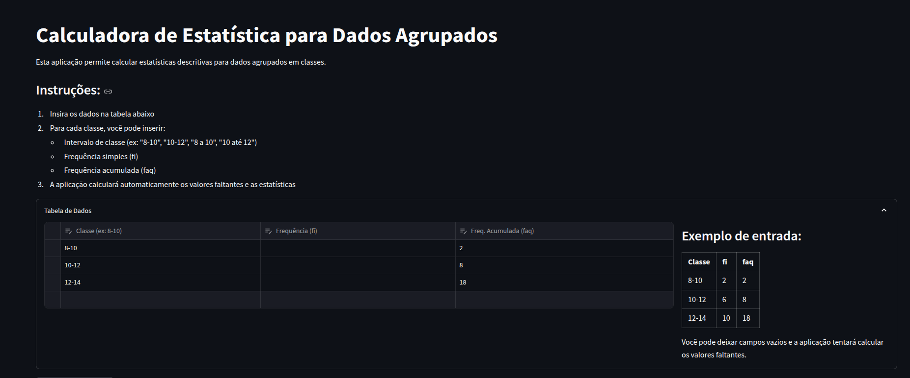
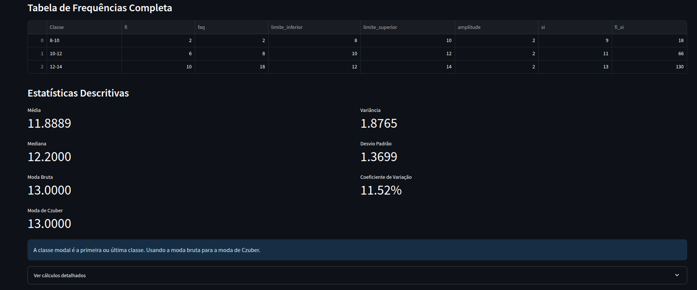
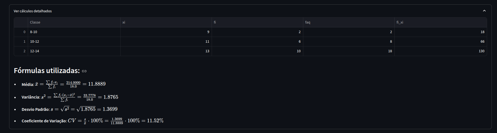

# calculadora-agrupamento-em-classes
Trabalho de faculdade para disciplina da estatistica. Consiste em uma calculadora para média, mediana, moda bruta e moda Czuber, variância, coeficiente de variância

# Setup

```bash
   python -m venv venv
   . venv/bin/activate # Linux
  
   pip install -r requirements.txt

   streamlit run src/app.py
```

# Features



# Resultados


